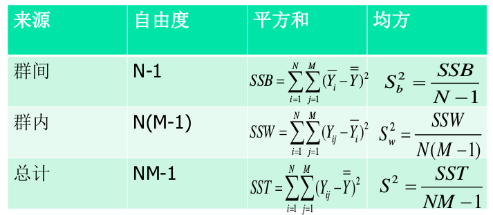

# 整群抽样

## 定义

将总体划分为若干群,以群为抽样单元,从总体中随机抽取一部分群,对入选群内的所有单元进行调查的一种抽样技术.

## 原则
群内差异尽可能大,群间差异尽可能小

## 规模
1. 相等
2. 不相等

## 群规模大小相等时的估计

### 符号说明
- M
- n
- M_i
- M_0
- Y_{ij}
- y_{ij}
- Y_i
- y_i
- \bar Y_i
- \bar y_i
- \bar Y
- \bar y
- \bar{\bar Y}
- \bar{\bar y}
- S^2
- S_b^2
- S_w^2
- s^2
- s_b^2
- s_w^2

# 等概率整群抽样

## 群规模相等时的估计量

### 均值估计量及其方差

### 估计量\bar\bar y的性质

#### 无偏性

#### 方差

#### 方差的样本估计

[Ex4.1](估计总体个体均值/README.md)

## 整群抽样效率分析

**NOTE**

1. 分层抽样中估计量 y st 的方差取决于层内变异性,若层均值间的变异性大于层内变异性(S_b^2/S_w^2取值较大)，则分层抽样提高精度。

2. 估计量的方差依赖于群间的变异性，如果整群抽样中(S_b^2/S_w^2)较大,则整群抽样就会损失精度

### 群内相关系数

1. 等群抽样的设计效应
2. 群内相关系数的三种表示

[Ex4.1](估计总体个体均值/README.md)

## 群规模不等时的估计

当群M_i规模不等时,有不同的抽取方法和估计方法
### 等概抽样，简单估计
### 等概抽样，加权估计
### 等概抽样，比率估计

[Ex4.2](三种等概估计/README.md)

