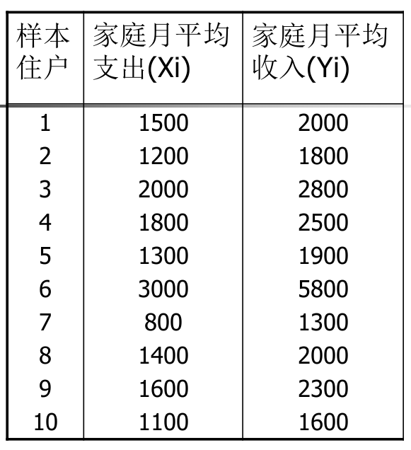

# 为比率的二重抽样
## 实际问题
某住宅小区共有200个住户,现欲估计小区住户家庭月平均收入的平均水平。家庭收入的数据不易调查,而家庭支出的资料相对容易获取,而且家庭月平均收入与家庭月平均支出之间强相关,因此拟采用二重抽样比估计方法。先从住户中随机抽取100个住户作为第一重样本,调查家庭月平均支出,结果家庭月平均支出的样本均值为1500元;然后从这100个住户中随机抽选10户作为第二重样本,调查家庭月平均收入和家庭月平均支出,资料见下表。试估计该小区家庭月平均收入,并计算估计量标准误差。

