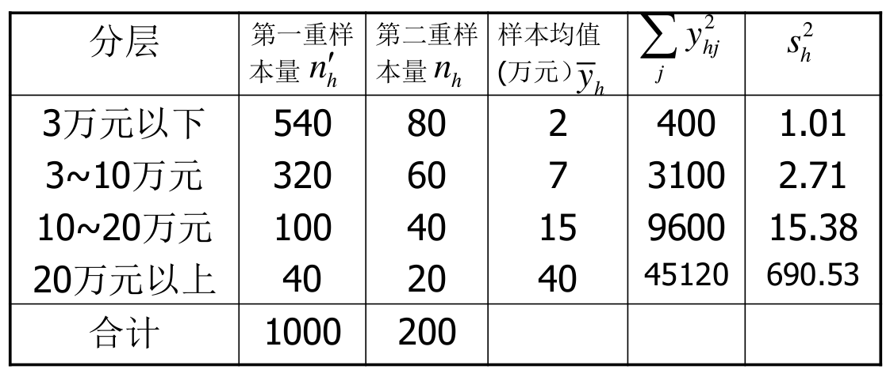

# 为分层的二重抽样

## 实际问题

某银行要调查其客户的资产情况。已知该银行的客户数
为8000,针对客户规模差异较大的特点,拟采用分层抽样。
但由于缺乏现有的分层资料,决定采用二重分层抽样方法,
第一重样本量 n'=1 000,根据其自报的资产情况可分为
4层:第一层为300万元以下;第二层为300万元~1000万元;
第三层为1000万元~2000万元;第四层为2000万元以上。
然后在第一重样本分层的基础上,在各层分别抽取第二
重样本。第二重样本量 n=200。通过对这200位客户进行
详细的调查,取得有关数据整理如表7—1,试估计该银行所
有客户的资产总额及其抽样标准误差。

