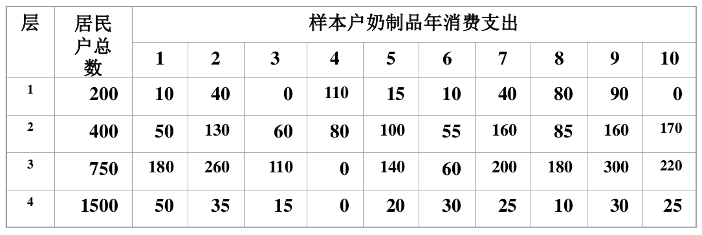

# 估计总体总量及其方差

## 实际问题
调查某地区的居民奶制品年消费支出,以居民户为抽样单元,根据经济及收入水平将居民户划分为4层,每层按简单随机抽样抽取10户,调查获得如下数据(单位:元),要估计该地区居民奶制品年消费总支出及估计的标准差。

## 理论知识

对于分层随机样本，总体总量的简单估计为

$$
\hat Y = N\bar{y_{st}} = \sum\limits_{h=1}^LN_h\bar y_h
$$

formula1: $$n==x$$
