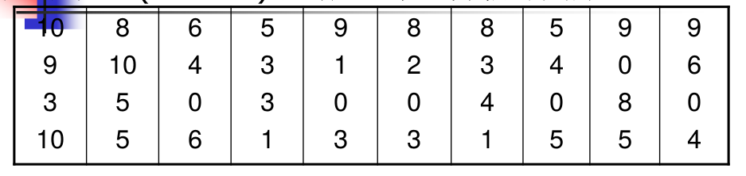

# 系统抽样方差估计

## 问题

在一连续生产线上,每隔k=100件产品抽取一件,
检查产品上的疵点数,下表是40个样品的检查结果。试估
计这批产品(N=4000)平均疵点数,并估计其方差。

## Remarks
1. 当总体单元排列是随机时,按简单随机抽样的
方差估计最适用,且计算也最简单。
2. 基于相邻样本观测值导出的估计量 v 2 , v 3 适用范
围很广,随机排列,线性趋势,周期变化的总体都能用,
效果也不错,因此若不清楚总体单元排列的规律,首选
这两个方差估计量。

3. 当样本量比较小时,尤以 v 2 更为适用。
4. 对线性趋势总体, v 2 , v 3 的估计更为接近实际。而 v 1 则常常高估了方差。
