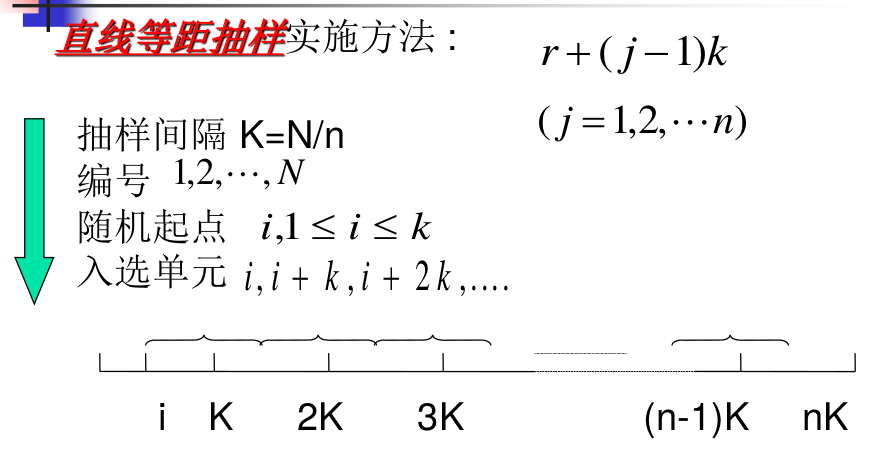
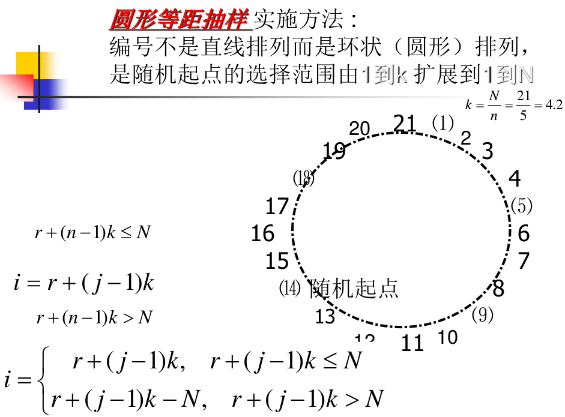

# 系统抽样

## 定义与实施方法

### 什么是系统抽样

1. 总体中的N个单元按一定顺序排列,
2. 抽取一个起始单元,
3. 按某种规则选取其它单元直到满n个为止

### 抽样类型

1、按无关标志排列
2、按有关标志排列
3、自然排列

### 两种实施方法

## 等概系统抽样

$N\neq nk$，由于$k$个可能样本所包含的单元数不全相等，因此$\bar y_{sy}$是有偏的。

三种改造为无偏估计量的方法
1. 采用圆形抽样系统
2. 采用直线抽样系统
3. 起始点仍在 1 ~ k 范围内随机产生

### 估计量方差的不同表示形式

1. S_{wsy}^2
2. \rho_{wsy}^2
3. S_{wst}^2
4. \rho_{wst}^2

#### 反映sy和srs关系的方差公式
#### 用等距样本内相关系数表示
#### 用同一等距样本内单元对关于层平均值的相关系数表示

[Ex6.3](Ex6.3/README.md)

[Ex6.4](Ex6.3/README.md)

### 估计量方差与总体单元排列顺序的关系

#### 随机排列总体
#### 线性趋势总体
#### 周期性波动总体

## 等概率系统抽样的方差估计

### 方差估计的形式

通常没有无偏估计

1. 系统样本作为简单随机样本对待

2. 考虑从第二个样本估计值开始，每个与前一个一组

3. n为偶数时，两两划分样本观测值

[Ex6.5](Ex6.5/README.md)

## 线性趋势总体

若总体单元按指标值从小到大顺序排列或按某个
与其有线性相关的辅助变量的大小顺序排列,此
时指标值与单元序号i也线性相关

### 中心位置样本法与首尾校正法
1. 麦多的中心位置样本法
2. 耶茨的首尾校正法
3. 贝尔豪斯与拉奥的圆形等距抽样法

[Ex6.6](Ex6.6/README.md)

### 对称等距抽样
消除或减轻由于不同起始单元位置而引起估计值偏差

1. 塞蒂的方法——层内对称系统抽样
2. 辛等人的修正方法——总体对称系统抽样

## 不等概率系统抽样

### \pi PS系统抽样及其实施方法
### 估计量及其方差与方差估计

1. 考虑将不放回的 \pi PS 系统样本作为放回的 PPS 样本处理
2. 考虑用相邻样本观测值差值的平方和来表示方差
