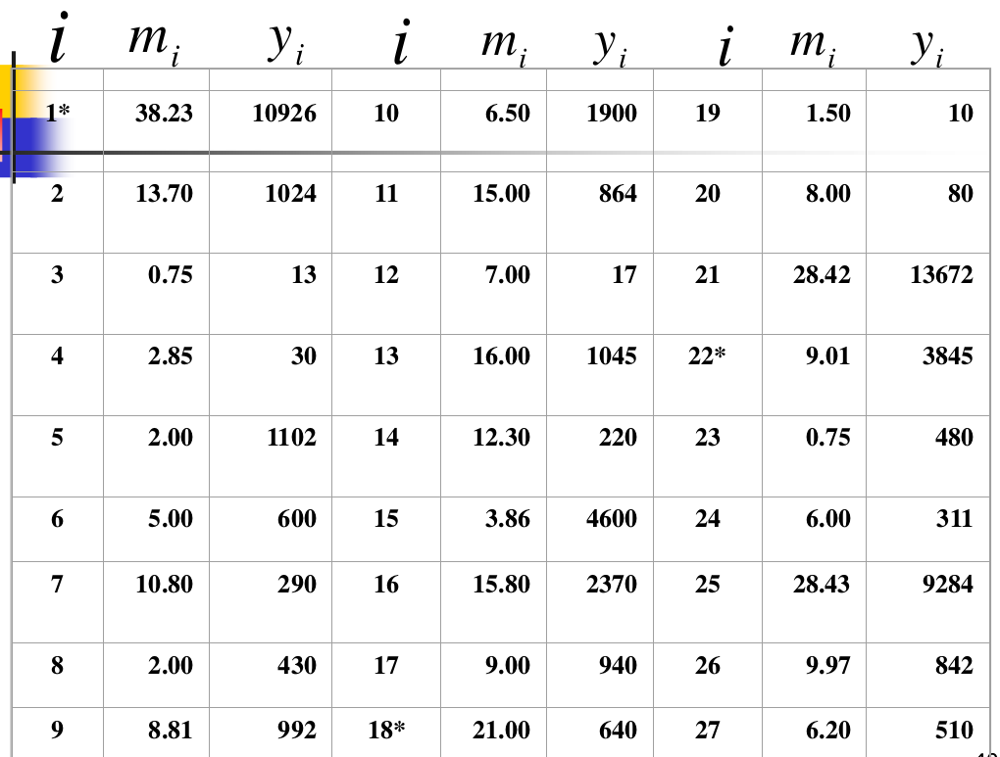

## 实际问题

某部门要了解所属8500家生产企业当月完成的利润,
该部门手头已有一份去年各企业完成产量的报告,
将其汇总得到所属企业去年完成的产量为3676万
吨。考虑到时间紧,准备采用抽样调查来推算当
月完成的利润。根据经验,企业的产量和利润相
关性比较强,且企业的特点是规模和管理水平差
异比较大,通常大企业的管理水平较高些,因此
采用以与去年产量成比例的PPS抽样,从所属企
业中抽出一个样本量为30的样本,

